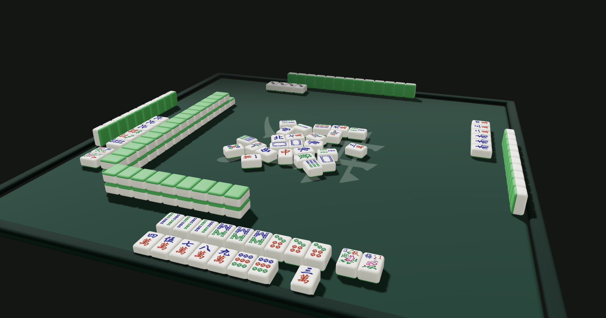

# Mahjong 3D

Infinite 3D Taiwanese Mahjong made with React Three Fiber.

Watch the idle sim [online](https://elh.github.io/mahjong-3d/) or as a
[macOS screen saver](https://github.com/elh/mahjong-3d/releases/latest/download/Mahjong3D.dmg) (macOS 26 Tahoe only).

[](https://elh.github.io/mahjong-3d/)

## What It Does

- Simulates Taiwanese 16-tile Mahjong.
- Renders a 3D scene with animated tile handling and a between-game transition.
- Includes a compact debug replay view for stepping through event logs by seed.

### Scope

- Taiwanese Mahjong variant only. Rule implementation may be incomplete.
- Bot implementation is very simple.
- 3D scene performance is unoptimized and may be poor in screen saver mode.
- This is not a playable client.

## Development

```bash
make install      # install dependencies
make dev          # start the Vite app
DEBUG=1 make dev  # enable controls like `?view=debug` and `?seed=...` control
make good         # format check, lint, knip, types, tests, and build
```

See [CONTRIBUTING](./CONTRIBUTING.md).

### macOS Screen Saver

The native wrapper lives in `macos/` and bundles the Vite screen saver build
into a small app with an embedded Screen Saver extension. See
[macos/README.md](macos/README.md) for build, install, package, and legacy
fallback details.

```bash
make install-screensaver
make package-saver
```

### Project Layout

```plaintext
.
├── src/
│   ├── sim/          Deterministic rules engine, event model, replay, invariants
│   ├── bots/         Bot interfaces and strategy
│   └── ui/           React UI and Three.js
├── public/tiles/     Mahjong tile SVG assets
└── macos/            Native macOS screen saver and packaging scripts
```

## Licensing

MIT. [Attributions](https://github.com/search?q=repo%3Aelh%2Fmahjong-3d+path%3A**%2FATTRIBUTION.md&type=code)
